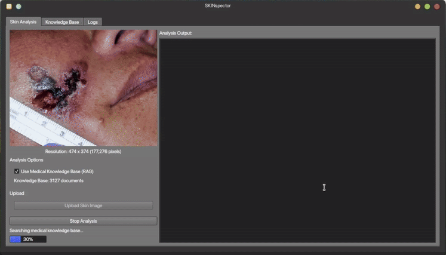

<p align="center">

</p>


# Demo
## RAG Inference


## Bare Inference


---

### Installation (Linux CPU Only)
> chmod +x setup_cpu.sh && ./setup_cpu.sh   
### Installation (Linux w/ GPU Acceleration)
> chmod +x setup.sh && ./setup.sh

---

### Run (w/ GUI)
> python3 ./src/run.py

## Run (Headless)
> chmod +x ./examples/demo/headless.sh
> ./examples/demo/headless.sh

---

Note: 
- Make sure systemwide CUDA version is 13.0 ( only for GPU Acceleration )
- GCC version is 14.0 ( both for GPU Acceleration and CPU only )
- uv is installed for reliable dependencies resolving

This project is not tested on Windows and WSL, for development please contact the maintainer of this repository.

---
**If you're using a part of this project for research purposes, consider to cite:**

```
R. M. Kam, A. F. Fatahillah, R. H. Tafara, F. Young, and M. Asanuddin, "SKINspetoR: Superfast, privacy centric RAG VLM dermatologist," 2026. [Online]. Available: https://github.com/RezkyKam50/SKINspector
```

---

**Citations**

```
Bai, Shuai. “[2502.13923] Qwen2.5-VL Technical Report.” arXiv, 19 February 2025, https://arxiv.org/abs/2502.13923. Accessed 27 December 2025.

Alexey, Dosovitskiy. “[2010.11929] An Image is Worth 16x16 Words: Transformers for Image Recognition at Scale” arXiv, 3 Jun 2021, https://arxiv.org/abs/2010.11929. Accessed 27 December 2025.

Yuhao, Shen. “[2405.18004] SkinCaRe: A Multimodal Dermatology Dataset Annotated with Medical Caption and Chain-of-Thought Reasoning.” arXiv, 9 Nov 2025, https://arxiv.org/abs/2405.18004. Accessed 27 December 2025.

Patrick, Lewis. “[2005.11401] Retrieval-Augmented Generation for Knowledge-Intensive NLP Tasks.” arXiv, 12 Apr 2021, https://arxiv.org/abs/2005.11401. Accessed 27 December 2025.

Yu, Gu. “[2007.15779] Domain-Specific Language Model Pretraining for Biomedical Natural Language Processing.” arXiv, 16 Sept 2021, https://arxiv.org/abs/2007.15779. Accessed 27 December 2025.

Xiaoxia, Wu. “[2301.12017] Understanding INT4 Quantization for Transformer Models: Latency Speedup, Composability, and Failure Cases.” arXiv, 30 May 2023, https://arxiv.org/abs/2301.12017. Accessed 27 December 2025.

Shih-Yang, Liu. “[2402.09353] DoRA: Weight-Decomposed Low-Rank Adaptation.” arXiv, 9 Jul 2024, https://arxiv.org/abs/2402.09353. Accessed 27 December 2025.

Pin-Lun, Hsu. “[2410.10989] Liger Kernel: Efficient Triton Kernels for LLM Training.” arXiv, 24 Jan 2025, https://arxiv.org/abs/2410.10989. Accessed 27 December 2025.

Tim, Dettmers. “[2305.14314] QLoRA: Efficient Finetuning of Quantized LLMs.” arXiv, 23 May 2023, https://arxiv.org/abs/2305.14314. Accessed 27 December 2025.
```
